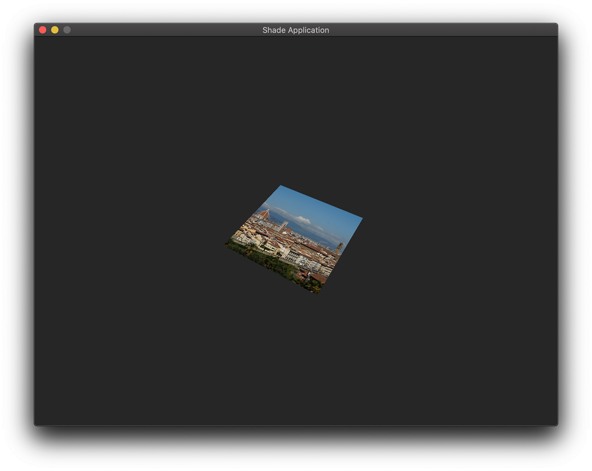

<p align="center">

</p>

Simple, cross-platform and low boilerplate graphics API based on Vulkan

**Note:** This project is currently in its alpha stages and is highly subject to API change. 

<p align="center">

</p>

## Building
Before building you must make sure that you have installed the following dependencies:
* CMake (>= 3.7)
* Vulkan-SDK (latest)

```bash
mkdir build
cd build
cmake ../
```
Now follow the following steps on your platform:
### Windows
Open the resulting solution in Visual Studio and build.

### MacOS & Linux
Run `make` in the build directory.